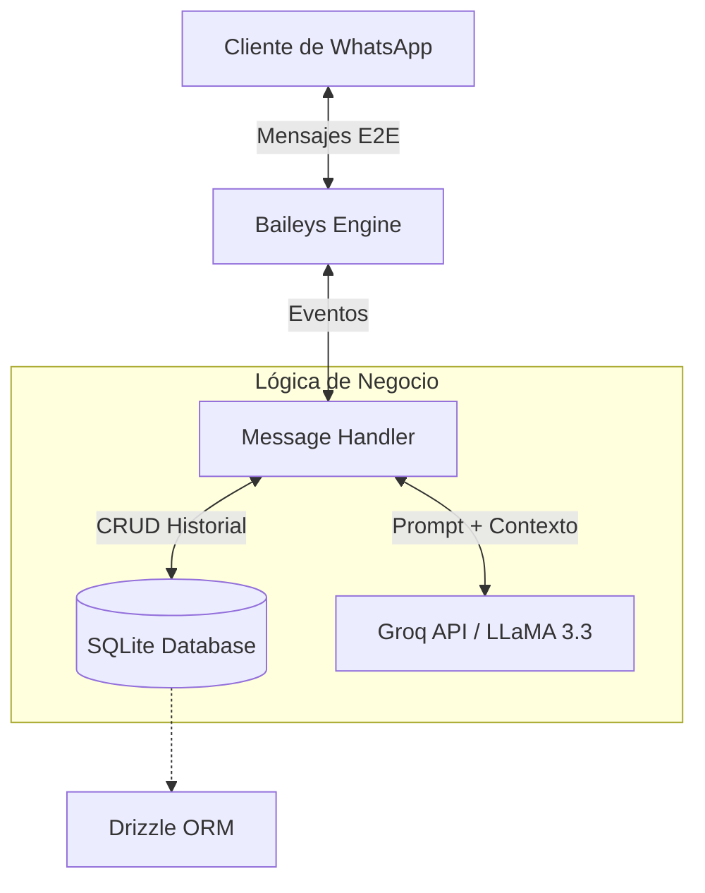

<div align="center">

# 🤖 WhatsApp AI Bot Enterprise

**Asistente Virtual Inteligente para Negocios impulsado por LLaMA 3.3**

[](https://www.typescriptlang.org/)
[](https://nodejs.org/)
[](https://groq.com/)
[](https://sqlite.org/)
[](https://www.docker.com/)
[](LICENSE)

*Conecta tu negocio a WhatsApp con respuestas automáticas, concurrentes y de baja latencia impulsadas por inteligencia artificial avanzada.*

</div>

---

## 🌟 Características Principales

- 🧠 **Respuestas Contextuales**: Integra LLaMA 3.3 (70B) vía Groq API para conversaciones naturales.
- ⚡ **Alta Concurrencia**: Arquitectura no bloqueante (`Promise.allSettled`) para procesamiento rápido de múltiples clientes.
- 💬 **Memoria Persistente**: Historial de conversación respaldado en SQLite (Drizzle ORM).
- 🔄 **Reconexión Automática**: Manejo resiliente de caídas de red y errores de sesión con Baileys.
- 🐳 **Docker-Ready**: Despliegue en producción con un solo comando.

---

## 📐 Arquitectura del Sistema



---

## 🛠️ Stack Tecnológico

| Capa | Tecnología | Función |
|---|---|---|
| **Runtime** | Node.js + TypeScript | Entorno de ejecución tipado y seguro |
| **Integración** | Baileys | API no oficial de WhatsApp Web (Sockets) |
| **Inteligencia** | Groq API | Motor de inferencia ultrarrápido para LLMs |
| **Persistencia** | SQLite + Drizzle ORM | Almacenamiento local ultraligero e indexado |
| **Despliegue** | Docker & Docker Compose | Contenedorización para producción 24/7 |

---

## 🚀 Instalación Local (Desarrollo)

### 1. Requisitos Previos
- Node.js >= 18
- TypeScript
- Git

### 2. Configuración
```bash
git clone https://github.com/Nix0010/whatsapp-ai-bot.git
cd whatsapp-ai-bot
npm install
cp .env.example .env
```

Edita el `.env` con los datos de tu negocio y tu `GROQ_API_KEY`.

### 3. Iniciar el bot
```bash
npm run dev
```
Escanea el código QR que aparecerá en tu terminal desde WhatsApp (Dispositivos vinculados).

---

## 🐳 Despliegue en Producción (Docker)

Para ejecutar el bot 24/7 en un VPS (AWS, DigitalOcean, Hetzner), la mejor opción es usar Docker. Esto garantiza persistencia de sesión y reinicio automático.

### 1. Iniciar el contenedor
Asegúrate de haber configurado tu archivo `.env` correctamente, y luego ejecuta:

```bash
docker-compose up -d --build
```

### 2. Escanear el QR (Primera vez)
Revisa los logs del contenedor para ver el código QR:
```bash
docker logs -f whatsapp_ai_bot
```
*(Presiona `Ctrl+C` para salir de los logs una vez escaneado).*

El volumen persistente (`./auth_info_baileys`) evitará que tengas que volver a escanear el QR si el contenedor se reinicia.

---

## 🕹️ Comandos Predefinidos (Prioridad Alta)

El sistema intercepta estos comandos antes de llamar a la IA para ahorrar tokens y tiempo:

| Comando | Acción |
|---|---|
| `hola` / `inicio` | Envía mensaje de bienvenida instantáneo |
| `ayuda` | Despliega opciones y menú principal |
| `precio` | Muestra formulario/información de cotización |
| `humano` | Pausa la IA y solicita intervención humana |
| `reset` | Limpia el contexto actual del cliente |

---

<div align="center">
  <sub>Construido con ❤️ por <a href="https://github.com/Nix0010">Nix0010</a> y potenciado por Arquitectura Multi-Agente</sub>
</div>
